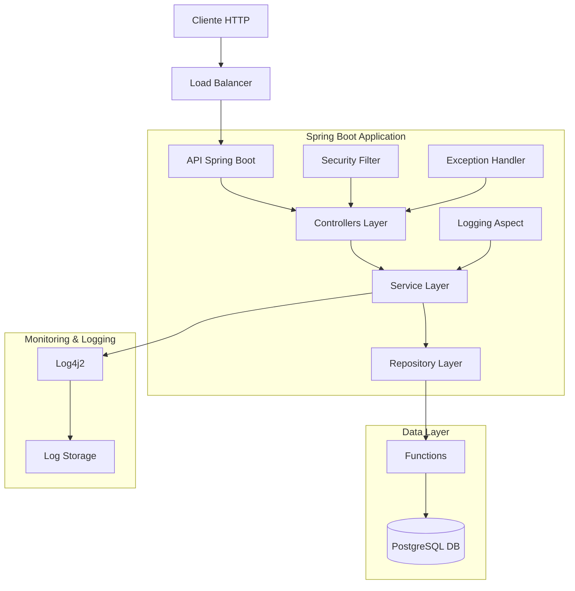
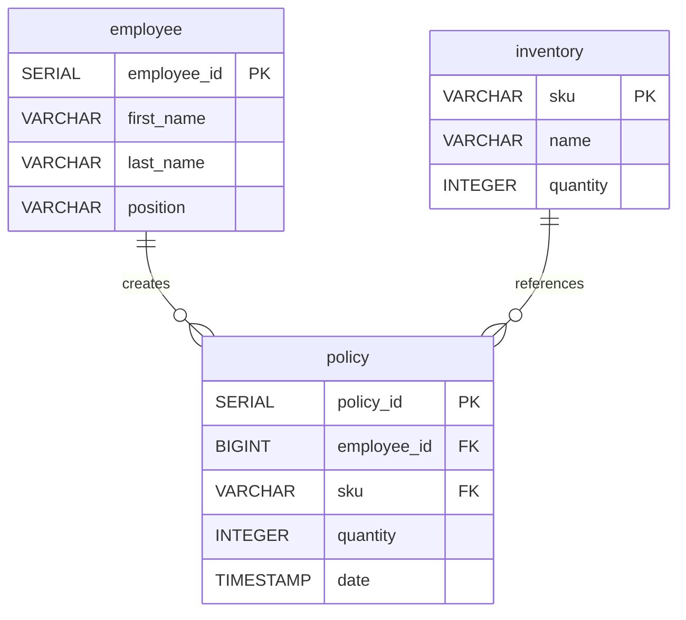
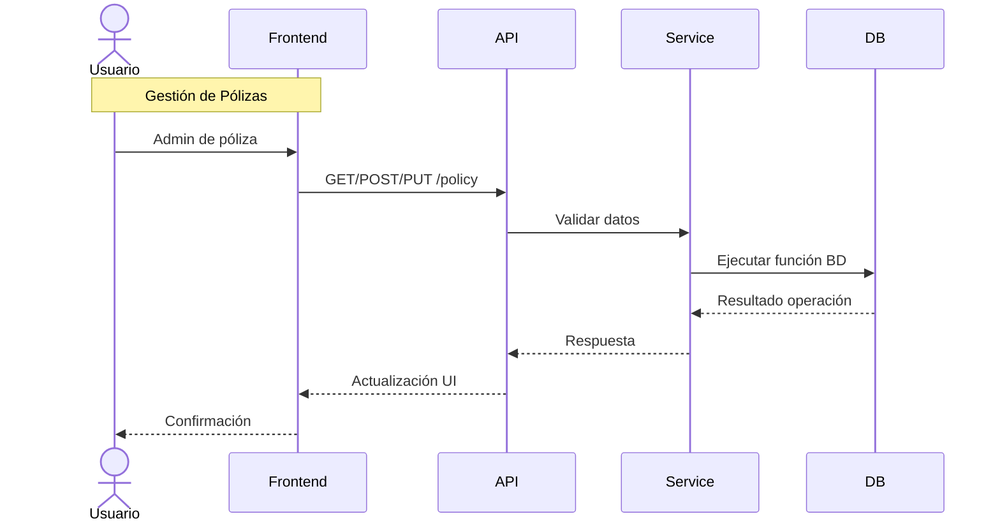
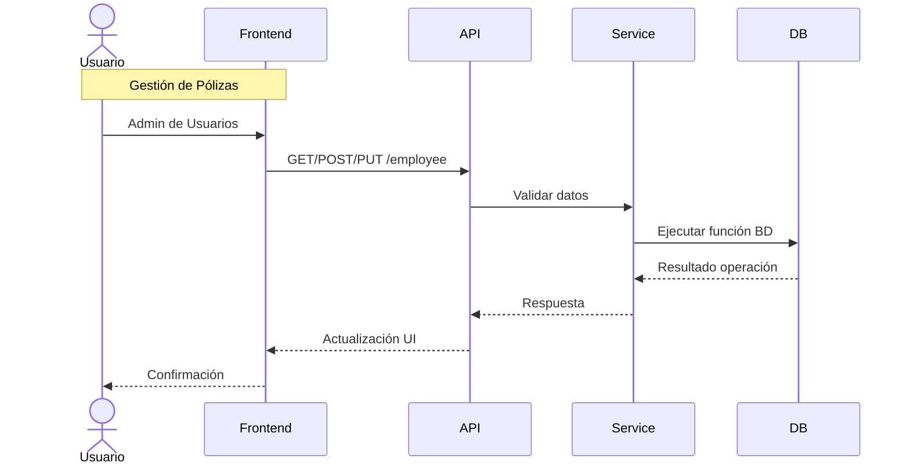

# Solución de Arquitectura

## Tipo de Solución

Considerando que el servicio debe ser centralizado y que la base de datos ya es utilizada por múltiples procesos, propongo una arquitectura centralizada con alta disponibilidad para garantizar un funcionamiento continuo.

## Listado de Impacto

La solución impactará los siguientes componentes del sistema:

* Sistema de gestión de pólizas
* Base de datos centralizada
* Servicios de autenticación y autorización
* Sistemas de logging y monitoreo
* Infraestructura de alta disponibilidad

## Componentes de la Solución

### Backend

* Tecnología: [Spring Boot 3.0](https://spring.io/projects/spring-boot) + [Java 17](https://openjdk.org/projects/jdk/17/)
* Características:
	+ Arquitectura en capas (Controlador, Servicio, Repositorio)
	+ API RESTful con endpoints para CRUD de pólizas
	+ Manejo de transacciones para asegurar la integridad de datos
	+ Sistema de logging con [Log4j2](https://logging.apache.org/log4j/2.x/)
	+ Manejo centralizado de excepciones
	+ Conexión a BD mediante [JdbcTemplate](https://docs.spring.io/spring-framework/docs/current/javadoc-api/org/springframework/jdbc/core/JdbcTemplate.html)
	+ Consumo de Funciones para operaciones en BD

### Base de Datos

* Tecnología: [PostgreSQL 15](https://www.postgresql.org/)
* Características:
	+ Modelo relacional normalizado
	+ Implementación de Funciones para lógica compleja
	+ Constraints para garantizar integridad referencial
	+ Índices para optimización de consultas frecuentes

## Diagrama Arquitectónico

El diagrama anterior muestra la interacción entre los diferentes componentes de la solución, incluyendo:
- Flujo de datos a través de las capas de la aplicación
- Componentes principales (Controllers, Services, Repositories)
- Interfaces de comunicación mediante API REST
- Mecanismos de seguridad y filtros
- Puntos de integración con la base de datos y sistemas de logging

Este diagrama refleja mejor la arquitectura en capas y la estructura del proyecto en `/src`. Los componentes mostrados corresponden a:

1. La capa de controladores REST (`main/controllers/`)
2. La capa de servicios (`main/services/`)
3. La capa de repositorios (`main/repositories/`)
4. Integración con PostgreSQL mediante Functions
5. Sistema de logging con Log4j2
6. Manejo de seguridad y excepciones

## Diagrama de Datos

Este diagrama representa de forma simple las principales entidades del sistema y sus relaciones, mostrando la estructura de datos que soporta la gestión de pólizas.

## Diagramas de Secuencia
Estos diagrama muestra el flujo principal de interacción entre los componentes del sistema de gestión de pólizas, ilustrando cómo se comunican las diferentes capas de la aplicación.

### Diagrama de pólizas

### Diagrama de Usuarios

